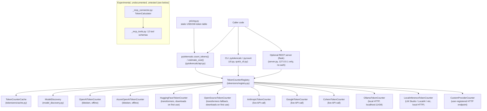

# Architecture

PyTokenCalc is a pure-Python library (no compiled/Rust code) built around
one core abstraction: a `TokenCounter` interface, implemented once per
provider, and a `TokenCounterRegistry` that picks the right implementation
for a given model string.

## Component overview



## Request flow

1. `count_tokens(text, model)` (or the CLI/server) calls into
   `TokenCounterRegistry.count_tokens()`.
2. The registry auto-detects a provider from the model string (see
   `registry.py::_auto_detect_counter` and
   [docs/MODELS.md](MODELS.md#model--provider-auto-detection)), or uses an
   explicit `provider=` argument if given.
3. The selected `TokenCounter` subclass does the actual counting:
   - **Local/offline** (`openai`, `azure`): loads a `tiktoken` encoding and
     counts locally, no network call.
   - **Local-after-first-download** (`huggingface`, `opensource`): calls
     `transformers.AutoTokenizer.from_pretrained(model_id)`. This downloads
     tokenizer files from the HuggingFace Hub the first time a given model
     ID is used, then caches locally. **There is no timeout on this call**
     (see Known gaps below).
   - **API-backed** (`anthropic`, `google`, `cohere`): makes a live HTTP
     call to the provider's own token-counting endpoint and requires an API
     key.
   - **Local-network** (`ollama`, local-inference engines, custom
     providers): makes an HTTP call to a locally-running server
     (`requests.get(..., timeout=1-2)`).
4. Results are wrapped in a `TokenCountResult` (input/output/image/system/
   tool token counts, latency, cache status, provider/platform metadata)
   and optionally cached by `TokenCounterCache`.
5. `estimate_cost()` is independent of all of the above: it looks up
   `model` in the static `PRICING_TABLE` in `pricing.py` and multiplies by
   token counts. It does not call any provider API.

## Directory layout

```
pytokencalc/
├── api.py                    # count_tokens() / estimate_cost() top-level API
├── pricing.py                 # static USD pricing table
├── model_discovery.py         # pattern-based provider/model suggestions
├── cli.py, quick_cli.py       # `pytokencalc` and `pycount` entry points
├── server.py                  # optional Flask REST server
├── statguardian_integration.py# quality-contract validation (see caveat below)
├── okf_token_baselines.py     # token-count baseline/ratio estimation
├── _mcp_connector.py          # experimental MCP tool-server connector
├── _mcp_tools.py               # experimental MCP tool schema definitions
└── tokenizers/
    ├── base.py                # TokenCounter / TokenCountResult ABC
    ├── registry.py             # provider auto-detection + routing
    ├── cache.py                # result caching
    ├── openai_counter.py, azure_openai_counter.py,
    │   huggingface_counter.py, opensource_counter.py,
    │   anthropic_counter.py, google_counter.py, cohere_counter.py,
    │   ollama_counter.py, local_inference_counter.py,
    │   custom_provider_counter.py    # one TokenCounter per provider family
    ├── encoding_fingerprint.py # tiktoken encoding-drift detection
    └── streaming.py            # incremental/chunked token counting
```

## Known architectural gaps (honest, not aspirational)

- **MCP subsystem is dead weight in the current package.** `TokenCalculator`
  (from `_mcp_connector.py`) is exported at the top level
  (`from pytokencalc import TokenCalculator`) and documented nowhere in
  README.md or docs/API.md. It has **zero test coverage** (no
  `test_mcp*.py` in `tests/`). Its "real" code path
  (`BaseMCPConnector.start_mcp_connector`) shells out to a `dab` binary
  that is not a dependency of this package and is not documented anywhere
  as a prerequisite; if `dab` isn't on `PATH`, or the optional
  `statguardian` package isn't installed, this silently falls back to an
  in-tree stub connector. Nobody outside this reviewer's pass has verified
  this code works end-to-end. Treat it as unsupported/experimental until
  it has tests and documentation, or remove it.
- **No timeout on HuggingFace tokenizer downloads.** Both
  `pytokencalc/tokenizers/huggingface_counter.py:71` and
  `pytokencalc/tokenizers/opensource_counter.py:102` call
  `AutoTokenizer.from_pretrained(model_id)` with no timeout. On a machine
  with no/degraded network access and a model ID not already cached
  locally, each such call blocks for the OS-level TCP connect timeout
  (60-75 seconds observed in this sandbox) with no way for a caller of
  `count_tokens()` to bound it, and there is no retry/backoff control.
  Confirmed while validating this repo: a local test run against an
  uncached model ID sat with an open `SYN_SENT` TCP connection for well
  over a minute before the underlying library gave up.
- **`statguardian_integration.py` and `okf_token_baselines.py`** implement
  real, testable logic (contract validation dataclasses, ratio-based token
  baselines) but their outputs are not wired into `count_tokens()` /
  `estimate_cost()` at all — they are separate opt-in APIs. If you don't
  explicitly import and call them, they do nothing.

See [ROADMAP_HONEST.md](../ROADMAP_HONEST.md) for the full technical-debt
list.
